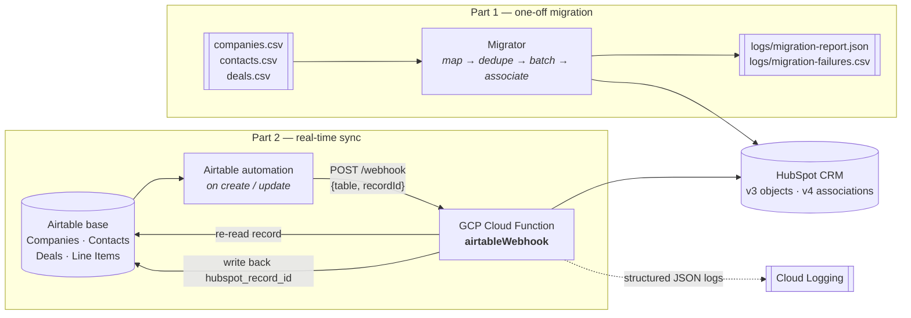

# HubSpot Data Migration & Airtable Sync

Two deliverables for the Wendt Partners technical assessment:

| Part | What it does | Entry point |
|------|--------------|-------------|
| **1 — Migration** | Bulk-loads `companies.csv`, `contacts.csv` and `deals.csv` into HubSpot, preserving Contact→Company, Deal→Company and Deal→Contact associations. | `npm run migrate` |
| **2 — Integration** | A GCP Cloud Function that syncs Companies, Contacts, Deals and Line Items from Airtable into HubSpot in real time, idempotently. | `index.js` (`airtableWebhook`) |

Both parts share one client, one logger, one error model and one set of value
transforms, so behaviour is consistent across them and each piece is tested
once.

---

## Contents

- [Architecture](#architecture)
- [Quick start](#quick-start)
- [Part 1 — Migration](#part-1--migration)
- [Part 2 — Integration](#part-2--integration)
- [Idempotency](#idempotency)
- [Logging and monitoring in GCP](#logging-and-monitoring-in-gcp)
- [Deployment](#deployment)
- [Testing](#testing)
- [Project layout](#project-layout)
- [Tools and libraries](#tools-and-libraries)
- [Assumptions](#assumptions)
- [What I would do with more time](#what-i-would-do-with-more-time)

---

## Architecture



Inside the Cloud Function, one request flows through four layers:

```
POST /webhook
     │
     ▼
┌─────────────────────────────────────────────────────────────┐
│ app.js          auth (shared secret) · correlation id       │
│                 error → HTTP status (the retry contract)    │
├─────────────────────────────────────────────────────────────┤
│ syncService.js  normalise payload · re-read from Airtable   │
│                 dispatch to a handler                       │
├─────────────────────────────────────────────────────────────┤
│ handlers/       company · contact · deal · lineItem         │
│                 map fields · resolve parent · associate     │
├─────────────────────────────────────────────────────────────┤
│ services/       hubspotService  → upsert, idempotency tiers │
│                 airtableService → read, link resolve, write │
├─────────────────────────────────────────────────────────────┤
│ shared/         client (rate limit + retry) · logger        │
│                 transforms · errors · schema                │
└─────────────────────────────────────────────────────────────┘
```

The layering is what makes the service testable: handlers receive their
services as arguments, so every test in the suite runs against in-memory fakes
with no network access.

---

## Quick start

```bash
npm install
cp .env.example .env      # then fill in your credentials

npm run bootstrap         # one-off: create the custom properties in HubSpot
npm test                  # 140 tests, no network calls

npm run migrate:dry-run   # Part 1: validate the CSVs, write nothing
npm run migrate           # Part 1: import for real
npm run dev               # Part 2: run the sync service locally on :3000
```

> **Rotate your credentials.** The `.env` in the original working copy held a
> live HubSpot private-app token and an Airtable PAT. `.gitignore` now excludes
> `.env`, but both keys should be revoked and reissued before this repo is
> shared, since they existed in plain text on disk.

---

## Part 1 — Migration

### Approach: API, not the native import tool

HubSpot's native CSV import can load these three files and even match
associations by column. I used the API instead, for reasons specific to this
dataset:

- **The source data needs repair before HubSpot will accept it.** `close_date`
  arrives in five different formats across the 400 deal rows, and `industry`
  uses labels that are not HubSpot's enumeration values. The native importer
  would reject or mangle those; code can normalise them and *report* what it
  changed.
- **Re-runnability.** A native import creates a new batch each time. This
  migration is idempotent, so it can be fixed and re-run against the same
  portal without producing duplicates — which matters a lot when the first run
  reveals a data problem.
- **An audit trail.** Every rejected row is written to
  `logs/migration-failures.csv` with the reason, in its original columns, ready
  to be corrected and re-fed. "395 of 400 imported" is not a useful result if
  you cannot say which five.

### Order of operations

Companies → Contacts → Deals → associations. Companies must exist before
anything can point at them, and all objects must exist before associations can
be written. Within each stage, work is batched 100 at a time (HubSpot's
maximum), with a **per-record fallback**: HubSpot's batch endpoints are
all-or-nothing and do not identify which record was invalid, so a rejected
batch is retried one record at a time. That turns "100 records failed" into
"99 succeeded, and here is the one that didn't, with HubSpot's exact
complaint".

### What went wrong in the first run, and why

The earlier implementation imported 300/300 companies, **395/400 contacts** and
**378/400 deals**. Investigating the gap:

| Rows | Root cause | Fix |
|------|-----------|-----|
| **20 deals** | `close_date` values in `MM-DD-YYYY` form (`09-17-2021`) had no branch in the date parser, so the raw string was sent as `closedate` and HubSpot rejected the whole record with a 400. | `parseDate` now handles dash-separated day/month dates, validates that the result is a real calendar date, and returns `null` rather than a bad string — an unparseable date now costs one property, not the record. |
| **5 contacts, 2 deals** | They reference `company_id` 304, 307 and 312, which **do not exist** in `companies.csv` (it contains ids 1–300 only). The old code filtered out any row whose company was unmapped, silently. | These are now imported without the company association, and the dangling reference is recorded in the report. Set `MIGRATION_IMPORT_ORPHANS=false` to reject them instead. |

Two further defects were found while rewriting, which had not yet caused
visible damage:

- **Batch results were matched back to source rows by name.** `deals.csv`
  contains 32 duplicate `deal_name` values, so `newDeals.find(d => d.deal_name
  === result.properties.dealname)` could map several source rows onto the same
  HubSpot id, corrupting the association map. Matching is now on the external
  id we wrote ourselves, which is unique by construction.
- **Deduplication cost one API call per record.** The old code issued a search
  request per company and per contact — roughly 1,100 calls. `batch/read` with
  `idProperty` resolves 100 records per call instead.

### Running it

```bash
npm run migrate:dry-run   # parses, maps, reports — no writes
npm run migrate
```

Output lands in `logs/`:

- `migration-report.json` — summary counts, every rejection with its reason,
  data-quality warnings, and every association that could not be written.
- `migration-failures.csv` — problem rows in their original columns plus a
  `failure_reason`, for correction and re-import.

The process exits non-zero if any row was rejected or failed, so it can gate a
CI step.

---

## Part 2 — Integration

### Trigger: Airtable automations

Airtable offers three ways to notice a change. I used **automations with a "Run
script" action** (`scripts/airtable-automation.js`), because:

- The **Webhooks API** is a pull model — you register a webhook, receive a ping,
  then call `listPayloads` to find out what changed, and manage a cursor. That
  is more moving parts and more state than this needs.
- **Polling** cannot meet the brief's "immediately, not on a manual trigger"
  requirement without a tight interval that burns API quota constantly. (A
  poller existed in the original code and has been removed.)
- Automations fire within seconds of the change, need no cursor management, and
  let the payload be shaped deliberately.

Each automation posts only `{ table, recordId }`. The service then **re-reads
the record from the Airtable API** rather than trusting the payload. This is a
deliberate extra call:

- A webhook payload is a point-in-time snapshot. If two edits happen quickly, or
  an event is redelivered late, replaying the payload would write **stale values
  over newer ones**. Re-reading makes the sync converge on Airtable's current
  state regardless of delivery order or duplication.
- Automation payloads routinely omit linked-record fields, which association
  resolution needs.

### Handlers

One handler per entity, each responsible for mapping, upserting, writing back
and associating:

| Airtable table | HubSpot object | Association | Natural key |
|---|---|---|---|
| Companies | `companies` | — (root) | `domain` |
| Contacts | `contacts` | → Company | `email` |
| Deals | `deals` | → Company | none (see below) |
| Line Items | `line_items` | → Deal | none |

**Deal stage mapping** (`src/integration/dealStage.js`) is the rule from the
brief — `Won → closedwon`, `Lost → closedlost`, anything else →
`qualifiedtobuy` — implemented as an allow-list with a default, matched
case- and separator-insensitively so `won`, `Won ` and `CLOSED-WON` all land
correctly. An unexpected status degrades to an open stage rather than failing
the sync.

**Deals associate to a Company only**, not to a Contact, per the brief.

**Line Items become real HubSpot `line_items` objects** associated with the
deal. The original implementation instead *added* each line total onto the
deal's `amount`. That was wrong twice over: it discards the line detail that
makes line items useful in quotes and reporting, and it is not idempotent — a
redelivered webhook would add the same total again and silently inflate the
deal. This is precisely the failure the brief's "safe to receive the same event
more than once" requirement is about, and there is a regression test for it.

**Out-of-order delivery is handled.** If a Contact's Company has not been synced
yet — easily possible, since Airtable fires automations independently — the
resolver syncs the parent on demand and then continues, so the association is
still written in that same invocation. Handlers therefore do not depend on
delivery order.

**Association failures do not lose the record.** A Contact whose Company cannot
be resolved is still created; only the association is deferred to the next
event. A Line Item is the exception — it has nowhere to live without its Deal,
so an unresolvable parent is a hard failure.

---

## Idempotency

The requirement is that the same event may arrive more than once without
creating duplicates. Every record this system writes — in both parts — is
stamped with a custom HubSpot property, `external_source_id`, namespaced by
source and object type:

```
csv:companies:12          ← from the migration
airtable:deals:recAbC123  ← from the sync service
```

Resolution walks three tiers, cheapest and most reliable first:

| Tier | Check | Catches |
|---|---|---|
| 1 | `hubspot_record_id` stored on the Airtable row | The normal update path. Verified with a GET, so a record deleted in HubSpot re-resolves instead of failing forever on a stale id. |
| 2 | Search on `external_source_id` | **The replay window.** A record created in HubSpot whose write-back to Airtable had not yet landed when the event was redelivered. This is the case that produced duplicates in the original code. |
| 3 | Search on the natural key — `domain` / `email` | Records that already existed in the portal (from Part 1, or entered by a salesperson), which the sync then *adopts* rather than duplicating. |

Only if all three miss is a record created. The external id is written on
**every** upsert, not just on create, so an adopted record becomes resolvable by
tier 2 from then on.

Deals and Line Items deliberately have no natural key: two genuinely different
deals can share a name, amount and close date, so matching on those would merge
distinct records. They rely on tiers 1 and 2 only — the conservative choice.

Supporting details:

- `external_source_id` is created with `hasUniqueValue: true`, so HubSpot itself
  enforces the constraint even if two function instances race.
- Associations are written with `PUT /crm/v4/objects/.../associations/default/...`,
  which is idempotent — re-asserting an association is a no-op, not a second one.
- Write-back to Airtable is skipped when the value would not change, so the sync
  cannot trigger its own webhook and loop.

Run `npm test -- idempotency` to see the twelve cases this is asserted against.

---

## Logging and monitoring in GCP

All logging goes through one Winston logger (`src/shared/logger.js`) that emits
**newline-delimited JSON on stdout**. Cloud Logging ingests that natively:
`severity` is promoted to the log level, and every other field is preserved as
queryable `jsonPayload`. No agent, sidecar or export configuration is required.

Every webhook invocation binds a **correlation id** (returned to the caller as
`X-Correlation-Id`) plus the entity, table and Airtable record id to a child
logger, so one query returns the complete trace of one record:

```
jsonPayload.airtableRecordId="recAbC123"
jsonPayload.correlationId="9f2c…"                    -- one invocation
jsonPayload.action="created" AND jsonPayload.objectType="deals"
severity>=ERROR AND jsonPayload.code="HUBSPOT_API_ERROR"
```

Failures log HubSpot's per-field validation `details` alongside the properties
that were sent, which is normally enough to diagnose a rejected record without
reproducing it.

Suggested log-based metrics and alerts (not configured here — see
[What I would do with more time](#what-i-would-do-with-more-time)):

| Signal | Filter | Why |
|---|---|---|
| Sync error rate | `severity>=ERROR AND jsonPayload.code!="VALIDATION_ERROR"` | Real faults, excluding bad user data |
| Rate limiting | `jsonPayload.message="Retrying after transient failure" AND jsonPayload.status=429` | Warns before throttling turns into failures |
| Unresolved parents | `jsonPayload.message=~"Parent record could not be resolved"` | Silent association gaps |
| Latency | `jsonPayload.durationMs` | Cold-start and HubSpot slowness |

Locally (and only locally), logs are also written to `logs/combined.log` and
`logs/error.log`, and the console format switches to a readable one-line-per-
entry layout.

---

## Deployment

### 1. HubSpot

Create a Private App in your sandbox with the scopes listed in `.env.example`,
then create the custom properties:

```bash
npm run bootstrap
```

Idempotent — safe to re-run, and it reports what already existed.

### 2. Airtable

Create the four tables with the fields from the brief. `hubspot_record_id` must
be a **single-line text** field on every table (not a number — HubSpot ids
exceed the safe integer range in some portals), and starts empty.

Link the tables: Companies ↔ Contacts, Companies ↔ Deals, Deals ↔ Line Items.
The resolver accepts `Company` / `Companies` / `Linked Company` (and the `Deal`
equivalents) as link field names, and falls back to matching on the
`company_id` / `deal_id` business key if no link is set.

### 3. Deploy the Cloud Function

Store the credentials in Secret Manager rather than as plain environment
variables:

```bash
gcloud secrets create hubspot-token   --data-file=- <<< "$HUBSPOT_ACCESS_TOKEN"
gcloud secrets create airtable-key    --data-file=- <<< "$AIRTABLE_API_KEY"
gcloud secrets create webhook-secret  --data-file=- <<< "$(openssl rand -hex 32)"

gcloud functions deploy airtable-hubspot-sync \
  --gen2 \
  --runtime=nodejs20 \
  --region=us-central1 \
  --source=. \
  --entry-point=airtableWebhook \
  --trigger-http \
  --allow-unauthenticated \
  --memory=512MB \
  --timeout=120s \
  --max-instances=10 \
  --set-env-vars=NODE_ENV=production,AIRTABLE_BASE_ID=appXXXX,LOG_TO_FILE=false \
  --set-secrets=HUBSPOT_ACCESS_TOKEN=hubspot-token:latest,AIRTABLE_API_KEY=airtable-key:latest,WEBHOOK_SECRET=webhook-secret:latest
```

Notes on the flags:

- `--allow-unauthenticated` is required because Airtable cannot present a Google
  identity token. The endpoint is protected by the `X-Webhook-Secret` shared
  secret instead, compared in constant time. The service **refuses to start**
  in production if that secret is unset.
- `--max-instances=10` bounds concurrency so a bulk edit in Airtable cannot fan
  out into enough parallel instances to exhaust the HubSpot rate limit. Each
  instance additionally throttles itself to `HUBSPOT_MAX_RPS`.
- `--timeout=120s` accommodates the worst case: a Line Item that has to sync its
  Deal, which in turn syncs its Company, before it can associate.

### 4. Wire up Airtable

Copy `scripts/airtable-automation.js` into a "Run script" action on each table's
automation (create *and* update triggers), set `ENDPOINT`, `WEBHOOK_SECRET` and
`TABLE_NAME`, and add `recordId` as an input variable mapped to the trigger
record.

### Local development

```bash
npm run dev                          # Express on :3000, same app as production
npx ngrok http 3000                  # public URL for Airtable to reach

curl -X POST http://localhost:3000/webhook \
  -H 'Content-Type: application/json' \
  -H 'X-Webhook-Secret: your-secret' \
  -d '{"table":"Companies","recordId":"recXXXXXXXXXXXXXX"}'
```

---

## Testing

```bash
npm test                # 140 tests
npm run test:coverage
```

**No test touches the network.** HubSpot and Airtable are replaced by in-memory
fakes (`tests/helpers/mocks.js`) that model the behaviour the logic depends on —
object storage, exact-match search, idempotent associations — so idempotency is
asserted against observable state ("exactly one company exists") rather than
against call counts.

| Suite | Covers |
|---|---|
| `transforms.test.js` | Date, currency, boolean, email, domain and phone parsing — including the `MM-DD-YYYY` regression |
| `dealStage.test.js` | Won/Lost/other mapping, both parts |
| `migrationMappers.test.js` | CSV → HubSpot property mapping, rejection vs. warning |
| `migrator.test.js` | Orchestration against CSV fixtures: orphan handling, batch fallback, duplicate deal names, association building, re-run behaviour |
| `idempotency.test.js` | All three resolution tiers, replay, adoption, stale ids, namespacing |
| `handlers.test.js` | Per-entity mapping, write-back, association, validation |
| `associations.test.js` | Link resolution, business-key fallback, on-demand parent sync |
| `webhook.test.js` | Payload normalisation, authentication, error → status mapping |
| `retry.test.js` | Backoff, `Retry-After`, retryable classification, rate limiter ordering |

---

## Project layout

```
├── index.js                      GCP Cloud Function entry point
├── src/
│   ├── migration/                Part 1
│   │   ├── index.js              CLI entry (npm run migrate)
│   │   ├── migrator.js           orchestration: map → dedupe → batch → associate
│   │   ├── mappers.js            CSV row → HubSpot properties
│   │   ├── csvReader.js
│   │   └── report.js             per-row audit trail
│   ├── integration/              Part 2
│   │   ├── app.js                Express app: auth, routing, error → status
│   │   ├── server.js             local dev server
│   │   ├── syncService.js        dispatch, Airtable re-read, correlation id
│   │   ├── normaliseEvent.js     tolerant payload parsing
│   │   ├── dealStage.js          status → deal stage
│   │   ├── handlers/             one per entity + shared parent resolution
│   │   └── services/             hubspotService (upsert), airtableService
│   └── shared/                   used by both parts
│       ├── hubspotClient.js      SDK transport + rate limit + retry + errors
│       ├── hubspotSchema.js      object types, external-id property
│       ├── transforms.js         pure value parsing
│       ├── logger.js             structured JSON → Cloud Logging
│       ├── errors.js             typed errors, retryable classification
│       └── config.js             validated configuration
├── scripts/
│   ├── bootstrap-hubspot.js      one-off custom property creation
│   └── airtable-automation.js    paste-in script for Airtable automations
├── data/                         CSVs (Part 1)
├── tests/
└── logs/                         runtime output (gitignored)
```

---

## Tools and libraries

| Library | Why |
|---|---|
| **`@hubspot/api-client`** | Official SDK. Used via its `apiRequest` transport rather than the typed per-object helpers, so CRM v3 objects and v4 associations share one code path — and one place to apply rate limiting, retry and logging, rather than remembering them at each call site. |
| **`airtable`** | Official SDK. Handles pagination and the base/table addressing. |
| **`winston`** | Structured JSON logging with child loggers, which is what makes per-request correlation ids practical. Its JSON output is directly ingestible by Cloud Logging. |
| **`express`** | The Functions Framework accepts an Express app directly, so the same app serves local development and production — no deployment-only code path. |
| **`@google-cloud/functions-framework`** | Runs the function locally exactly as GCP runs it. |
| **`csv-parser`** | Streaming CSV parser; correct quoted-field handling (the `amount` column contains `"$48,469"`). |
| **`jest` + `supertest`** | Standard, zero-config; `supertest` exercises the real Express app including auth and status mapping. |

`axios` and `cors` were dropped: the SDK covers HTTP, and CORS has no meaning
for a server-to-server webhook — it was permitting browser origins that should
never have been calling this endpoint.

---

## Assumptions

1. **The CSV `deal_stage` column already holds HubSpot internal stage ids**
   (`closedwon`, `contractsent`, …), which the data confirms. Values are still
   validated against the known set, and an unrecognised one warns and defaults
   rather than failing. The Airtable `status` field is separate and uses the
   Won/Lost mapping from the brief.
2. **Company ids 304, 307 and 312 are genuine gaps in the source export**, not a
   parsing error on my side — `companies.csv` contains exactly ids 1–300. The
   affected records are imported without the association and flagged.
3. **Ambiguous dates are US month-first.** `05/06/2024` is read as 5 June. This
   matches the dominant convention in the export; a value is only re-read as
   day-first when month-first would be an impossible date.
4. **Email is the identity of a contact.** A contact row without a valid email
   is rejected rather than imported, because a contact with no email cannot be
   matched on a later run and would duplicate on every subsequent sync.
5. **All deals belong to the `default` pipeline.** The source data carries no
   pipeline column.
6. **`hubspot_record_id` is a text field in Airtable**, not a number.
7. **The Airtable automation is trusted to name its own table** — the payload
   supplies the table name rather than the service inferring it.
8. **Deal amounts are in a single currency**, since the export has no currency
   column.
9. **Sync is one-directional**, Airtable → HubSpot, as specified. Nothing reads
   changes back out of HubSpot.
10. **`external_source_id` is reserved for this system.** Editing it by hand in
    HubSpot would break duplicate detection for that record; the property
    description says so.

---

## What I would do with more time

**Queue-based processing.** Today the Cloud Function does the work
synchronously inside the request. I would put Pub/Sub between the webhook and
the sync: the HTTP function would validate, enqueue and return 202 in
milliseconds, and a subscriber would do the work with Pub/Sub's retry and a
dead-letter topic. That removes the timeout ceiling, absorbs bulk edits without
fanning out instances, and gives failed events somewhere to land instead of
being lost. `syncService` is already decoupled from HTTP, so this is a change of
entry point rather than a rewrite.

**Bi-directional sync.** HubSpot webhooks → the same service, writing back to
Airtable. The hard part is not the plumbing but loop prevention and conflict
resolution: I would tag each write with its origin, ignore echoes of our own
changes, and pick an explicit conflict policy (last-write-wins on a per-field
`updatedAt`, or one system designated authoritative per field) rather than
letting it be emergent.

**Monitoring and alerting.** Terraform the log-based metrics in the table above,
an uptime check against `/health`, and alert policies on error rate and 429
frequency routed to Slack. Right now the signals are queryable but nobody is
told.

**CI/CD.** GitHub Actions running `npm test` and `npm audit` on every PR, and
deploying to GCP on merge to `main` via Workload Identity Federation (no
long-lived service-account key). A staging portal and staging base so
integration changes are exercised against real APIs before production.

**Contract tests against real APIs.** The unit suite mocks both APIs, which is
right for fast feedback but cannot catch HubSpot changing a validation rule. A
nightly job running the same handlers against a sandbox portal would close that
gap.

**Migration improvements.** Streaming the CSVs in two passes so the approach
holds at millions of rows rather than hundreds; and a `--only=deals` flag to
re-run a single stage after correcting `migration-failures.csv`.

**Field-level configuration.** The Airtable→HubSpot field mapping is currently
in code. Moving it to a declarative config would let a solutions consultant
adjust mappings for a new client without a deploy — which is the shape this
would need to take to be reused across engagements.

**TypeScript.** The JSDoc annotations throughout carry most of the type
information already; compiling them would catch property-name typos (`price` vs
`unit_price`) at build time rather than as a HubSpot 400.
